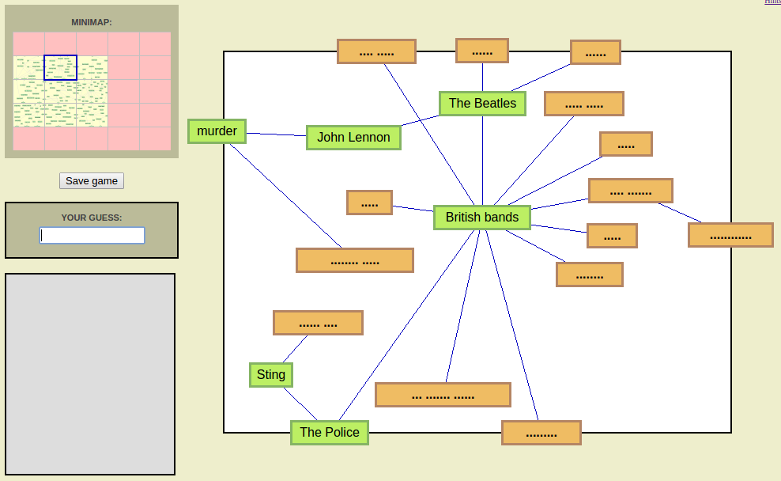

# Terminology

One of the trickier parts of programming is naming things. Finding intuitive ways to describe stuff, over and over again. It's not necessarily hard, it just comes up a lot and it can get a bit exhausted. 

The easiest way (in my opinion) is to use a mental model. Find something that exists in the real world that's *kinda* similar and just use the same terms. 

Let's look at Funny Farm for a moment

There's a handful of things going on here, so let's just focus on the minimap on the left and the big area on the right. Those are the basic components of the Funny Farm mind map.

Let's start at the most basic element - the rectangles with words or symbols in them. These make me think of scrabble tiles, so I refer to these as "Tiles"

*Mental Models: It's just that easy*

I actually spent a decent amount of time calling them a bunch of other things. Words, Boxes, Label. They all worked, but they were all a bit ambiguous. A word had a word and a box surrounding it, a box contained a box and a label, a label was surrounded by a box. Nothing especially confusing, but ultimately Tile ended up being cleaner.

So that's the most basic element of a mind map, tiles. 

Next up is the container for the tiles. They're all grouped by category ("British Bands" in this case), so "category" is a nice candidate - except that not all of them *have* a central category. Let's put that aside for a moment, because it ties in to the next one.

The overall mind map already had a model attached to it. The top right hand corner has the mini-map, meaning that the overall construction is the Map. Done. It's a great description, and so I just stole it entirely.

Back to the categories thing. What's a good name for a subsection of a map? A suburb? Nah, too literal. An area? It works, but it gets confusing with the maths-Area. A zone? Yup! That's the ticket.

And that leaves with a map, made up of smaller zones, which consist of a collection of tiles.

Map, Tile, Zone. Let's move on.

# Data Structures

If you want to read a book you own, how do you do it?

Do you go to your meticulously organised bookshelf, go to the appropriate genre and letter and then look through them until you spot the book?

Do you enter your room containing a monstrous pile of books which you have to fight through?

Do you go to your regular and mostly unsorted bookshelf, and then just poke around a bit?

There's nothing *wrong* with any of these solutions, but they all going to happen at different speeds. It's the same with information on a computer. There's a million different ways to organise something, each with different advantages and disadvantages.

We call these different organisation methods "Data Structures". I'm studying them in more depth in university right now - the organisation of information. It's so interesting, and it comes up all the time. In fact (cue seque) it's about to come up in Project Mind Map.

The sole user interaction for Project Mind Map is that they enter a word, and if that word is on the map it's tile gets revealled. But it's a little more than that - for a tile to be ABLE to be revealed, it needs to have a connected tile that is already revealed. As such, each tile has 3 possible "states"

1. Hidden. Just doesn't show up to the user.
2. Visible. The word is still obfuscated, but you can at least SEE the tile.
3. Revealed. The tile is visible, and so is the word.

If a tile is revealed, then any hidden and connected tiles will become visible.

Now for the data structure part: How do we *find* a tile? Visually it's easy - just look at any visible tile and check if that's the right one. In code it's not quite as simple.

There's a lot of theory on graph traversal and data structures and this and that and the other, but that's more of a "university degree" topic than a "random blog" topic. Instead, I'd like to present a few methods I've considered to solve this problem.

# Zone Lookup

This is a method I've been calling "zone lookup", because it works a little bit like a phone book. For this method, each zone holds a list of the tiles inside of it. Then, to find any given tile it just needs to ask each zone "Do you have this tile?". If it does, you stop searching. If it doesn't, you go to the next zone. If it's not in any zone, return null.

~~~
for each zone:
    if zone.contains(tile):
        return zone;
return null;
~~~

This is what the old system was, and it has its ups and downs. The biggest advantage is how easy to implement it is. It's just looking through a few lists. The biggest downside is that it has what's called O(n) efficiency. What that means is that, worst case scenario, if there's n tiles, it'll take n attempts to find the tile. If I've got 100 tiles total, it might find it on the first attempt, but worst case is that it'll find it on the 100th attempt.

This isn't actually too ineficient, but if someone makes an enourmous map (say, ten thousand tiles), it'll be kinda slow sometimes. Let's see if we can efficiency it up a bit.

# Revealed neighbours

There's probably a better name for this, but we're going to go with "revealed neighbours" because I've named enough things todays.

This method relies on the fact that, for the most part, we're not looking for tiles that exist on the map - we're looking for tiles on the map *that can be guessed*. Visible tiles.

To implement this method, we need to keep a list of revealed tiles (1 at the start of the game, but it'll grow)

Then, we ask each revealed tile to have a look at its **visible** neighbours, and see if they're the ones we're after. If it's not, we just keep looking.

~~~
for each revealed:
    for each revealed.neighbours:
        if neighbour == target:
            return neighbour;
return null;
~~~

This one is a little trickier to implement, though honestly not by much. My biggest concern with it would be having a way to get that first revealled tile, but otherwise this would be way more efficient. I don't actually know the O(whatever) for it, but it should hypothetically be better than O(n).

One disadvantage though, is that as the game goes on there'll be more and more revealed tiles to go through, so it'll get a bit slower. This could be helped by removing any revealed tile with no visible neighbour (as in, all the neighbours are now revealled), but even then the list will grow.

# Visible list

This one is pretty similar to the last one, honestly. Keep a list of all the **visible** tiles, removing them as they get revealed. The only real problem with this is the same as the last one, because the list will get longer and longer as the game progresses. Hopefully not insurmountably so, but definitely something to consider.

# Conclusion

I'm still tossing up which one to go with. The second and third ones are definitely *better*, but I don't know that zone lookup would be slow enough to really be a problem. If I can do a quick and functional implementation, I'd probably prefer that over a slow and more efficient implementation.

There's a saying in computer science. *premature optimization is the root of all evil*. What that means is that yes, I could spent the next week implementing the fastest possible tile lookup. It could have O(1) efficiency (so no matter how many tiles there are, it's always gonna take the same amount of time to find) and all of these other great efficiency features. But the problem is that it would be the most efficient *not actually a game* in all of town.

If I get down the line and find that tile lookup is actually being slow, great - I'll do it again but better. But there's a chance it won't be a problem, and any time spent optimizing now would be wasted.

Whole projects get swallowed up into premature optimization. Not this one, though.

There wasn't any explicit code or actual progress in this one, so instead take this Gif of a botched attempt at making a camera.

I don't know what went wrong, but the results are terrifying.

[Link](https://gfycat.com/gifs/detail/SerpentineSpanishArcticwolf)